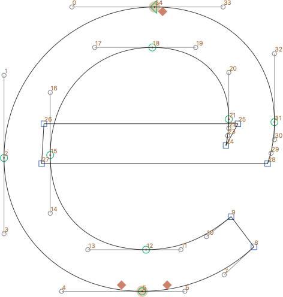
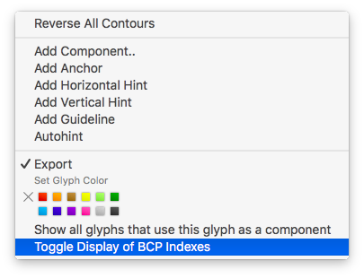

# ShowNodeIndexes.glyphsReporter

This is a plugin for the [Glyphs font editor](http://glyphsapp.com/) by Georg Seifert.
It displays node indexes next to the nodes. This is mainly useful for coding.

After installation, it will add the menu item *View > Show Node Indexes* (German: *Zeige Indexnummern*, Dutch *Toon Indexgetallen*). You can set a keyboard shortcut in System Preferences.

### Options

You can choose to display only on-curve index numbers, i.e., hide the indexes of BCPs (off-curves). To do that, right-click or Ctrl-click anywhere in the canvas, and choose *Toggle Display of BCP Indexes* (German: *Anfasser-Indexnummern ein/ausblenden*, Dutch: *Indexgetallen voor BCPs in/uitschakelen*).

### Installation

1. Download the complete ZIP file and unpack it, or clone the repository.
2. Double click the .glyphsReporter file. Confirm the dialog that appears in Glyphs.
3. Restart Glyphs

### Usage Instructions

1. Open a glyph in Edit View.
2. Use *View > Show Node Indexes* to toggle the display of the metrics keys.

### Requirements

The plugin needs Glyphs 2.3 or higher, running on OS X 10.9.5 or later.

### License

Copyright 2016 Rainer Erich Scheichelbauer (@mekkablue).
Based on sample code by Georg Seifert (@schriftgestalt) and Jan Gerner (@yanone).

Licensed under the Apache License, Version 2.0 (the "License");
you may not use this file except in compliance with the License.
You may obtain a copy of the License at

http://www.apache.org/licenses/LICENSE-2.0

See the License file included in this repository for further details.
